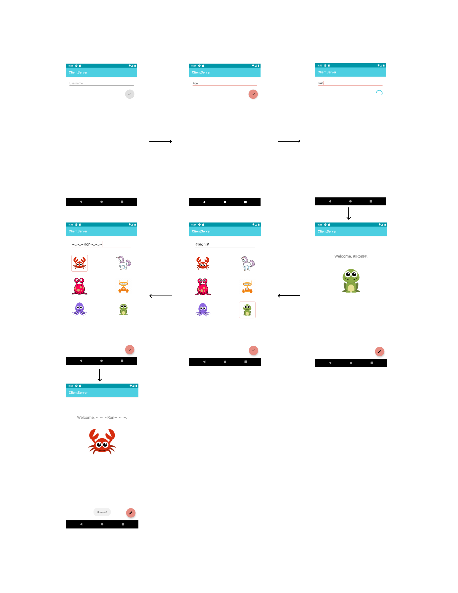

# postpc-2021-ex10:  Client-Server app

An android app for communicating with server, downloading data, displaying it to the user and letting the user change their data in the server.

## Project Structure

This project consists of 5 packages:
* models: Contains a simple User data class.

* server: Contains the retrofit's interface ServerInterface and ServerHolder, a singleton that holds the server's instantiation.

* ui: Contains MainActivity and the 3 fragments:
    - LandingFragment which lets the user input their name.
    - UserInfoFragment which shows the user their info and contains a button to edit the info.
    - EditUserInfoFragment which is reached by clicking the button in the previous fragment, lets the user change their 'pretty_name' (display name),
      and their image. 
 
* viewmodels: Contains the UserInfoViewModel which extends AndroidViewModel and stores all the user information and is responsible for starting
and handling the workers that get/set the user's info.

* workers: 4 workers extending WorkManager's worker for getting the user's token and info and updating his display name and image.

When the user first launches the app, it loads a fragment which requests the user's username and enables the button when the input is correct.
Upon click on the button,the app shows a circular progress indicator until the token response from the server was received.
Once the token arrived, the app navigates forward to a fragment which displays the user's info.
If the app was already launched in the past, it has a saved token in SharedPreferences and will navigate directly into this fragment upon
subsequent launches. If the user clicks on the edit button, the app navigates to a fragment which enables him to edit his current
"pretty_name" and image. Upon successful edit and POST to the server, the app navigates back to the previous fragment, 
which is now showing the most updated information.

A simple flow can be seen here:

## Question
As a client, at the first time you got a token. You have 2 options:
a. save the token locally (for example in a file or in SP)
b. use this token only in this current app-launch, and re-request a token from the server each time the app launches again.
Write at least 1 pro and 1 con for each implementation (a) & (b).
## Answer
a. Pro: faster and more efficient, no need to get the token from server upon every launch of app.
   Con: If the app's memory is erased, we still have to get it remotely.
b. Pro: Does not rely on local storage, more secure in case token changes.
   Con: Requires constant input from user and input upon every launch.
   

## Android components and libraries used

* Fragments
* Navigation
* View-Model
* LiveData
* MVVM Architecture
* Material Design Components
* WorkManager
* Retrofit
* OkHttp

## Academic Integrity
I pledge the highest level of ethical principles in support of academic excellence.  
I ensure that all of my work reflects my own abilities and not those of someone else.
