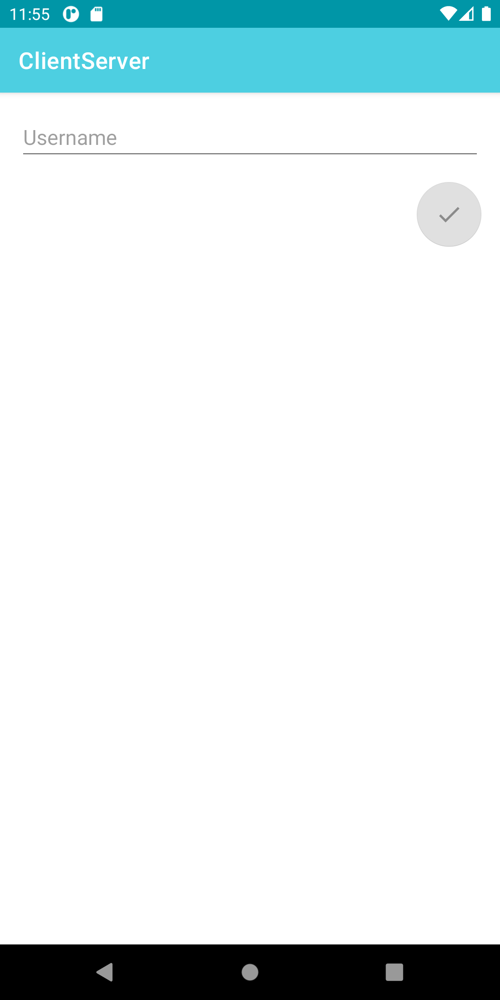
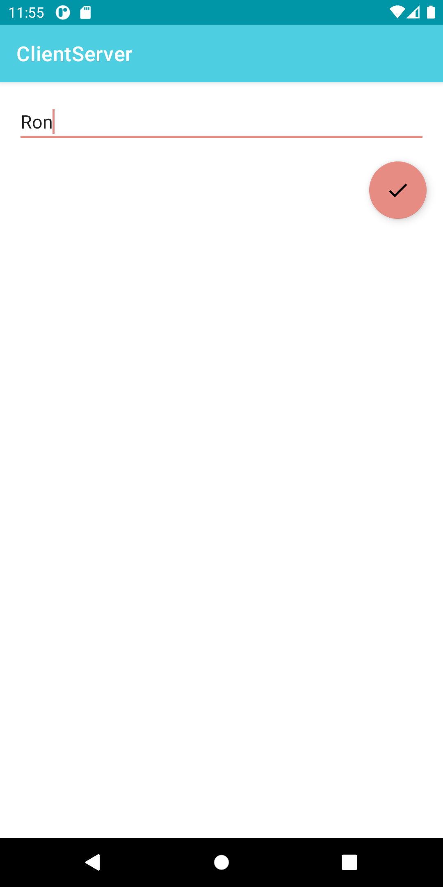
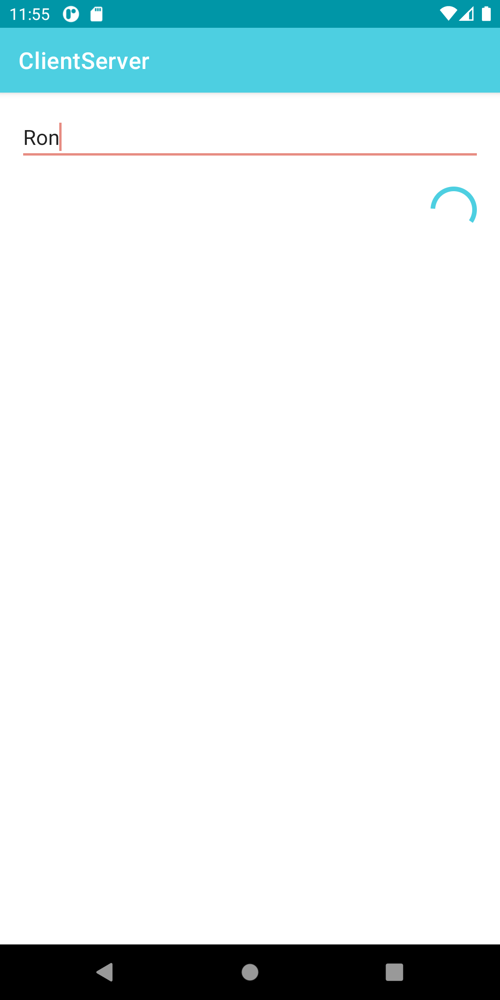
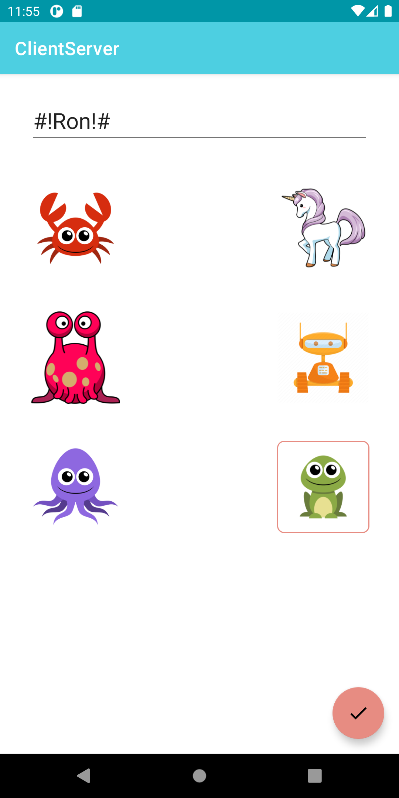
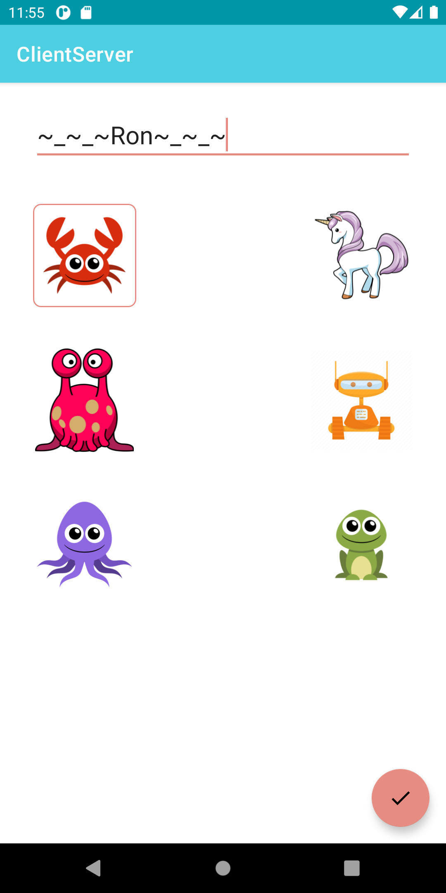
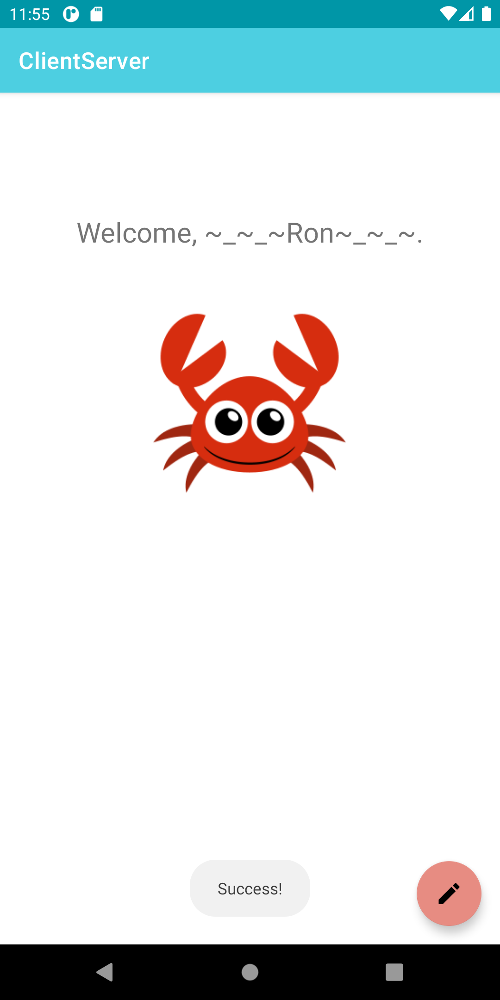

# Client-Server app

"# postpc-2021-ex10" 

I pledge the highest level of ethical principles in support of academic excellence.  
I ensure that all of my work reflects my own abilities and not those of someone else.

## Question
As a client, at the first time you got a token. You have 2 options:
a. save the token locally (for example in a file or in SP)
b. use this token only in this current app-launch, and re-request a token from the server each time the app launches again.
Write at least 1 pro and 1 con for each implementation (a) & (b).
## Answer
a. Pro: faster and more efficient, no need to get the token from server upon every launch of app.
   Con: If the app's memory is erased, we still have to get it remotely.
b. Pro: Does not rely on local storage, more secure in case token changes.
   Con: Requires constant input from user and input upon every launch.
   

## App flow
When the user first launches the app, it loads a fragment which requests the user's username and enables the button when the input is correct:

 

Upon click on the button,the app shows a circular progress indicator until the token response from the server was received:

Once the token arrived, the app navigates forward to a fragment which displays the user's info.
If the app was already launched in the past, it has a saved token in SharedPreferences and will navigate directly into this fragment upon
subsequent launches.

If the user clicks on the edit button, the app navigates to a fragment which enables him to edit his current "pretty_name" and image:

 

Upon successful edit and POST to the server, the app navigates back to the previous fragment, which is now showing the most updated information:

